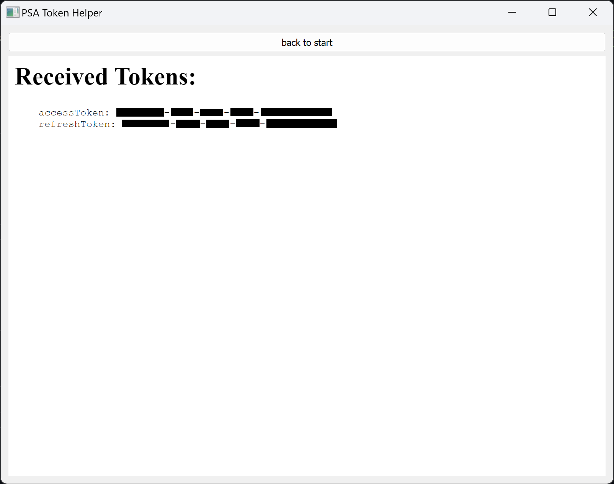

# PSA Token Helper
This is an experimental tool to easy get OAuth2 tokens for a PSA account (Citroën, DS, Opel, Peugeot) and is meant as a proof of concept.  
The received tokens can then be used for example with [EVCC](https://github.com/evcc-io/evcc)

It is a simple Python GUI application with an embedded web browser QtWebEngine.
The start page has pre generated login links with an authorization challenge for each brand.
After the login, the browser can read the authorization code from the redirect URL and use it to fetch the tokens.

## Usage
### Windows
There is a pre-built executable (PyInstaller one-file bundle) in the [release section](https://github.com/hurzhurz/psa-token-helper/releases).
### Home Assistant / Docker
See https://github.com/hurzhurz/psa-token-helper-addon
### General
Install Python3 and the necessary modules to run psa-token-helper.py.  
Here as an example with an python virtual environment:
```
python3 -m venv venv
source venv/bin/activate # on windows: .\venv\Scripts\activate
pip install PyQT5 PyQtWebEngine requests

python psa-token-helper.py
```

## Screenshots
* Step 1: select brand

* Step 2: login

* Step 3: final confirmation

* Step 4: display of received tokens

